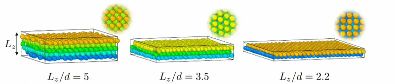
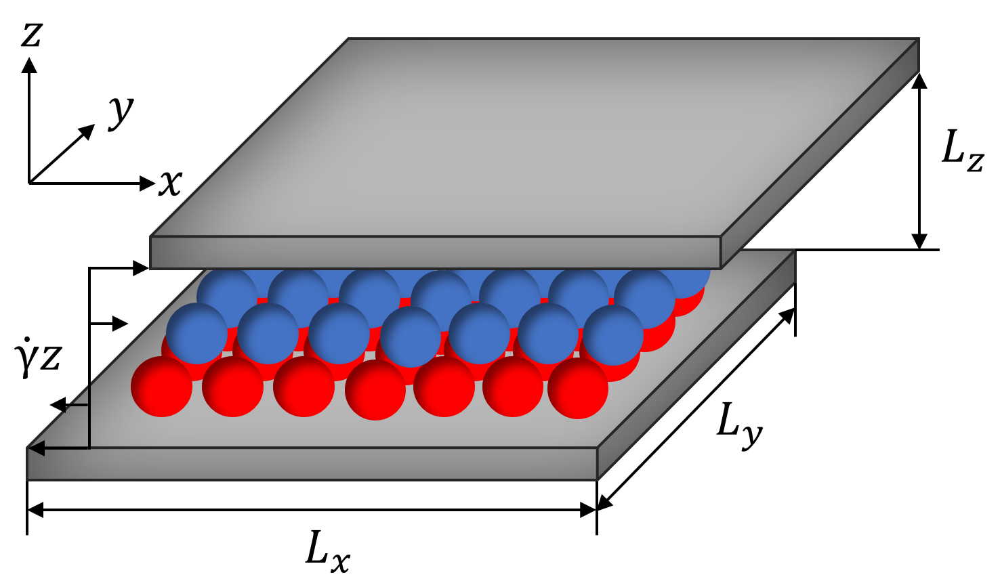

# shearedSlitporeBD

Brownian dynamics simulations of charged colloidal particles confined to a sheared slit pore. The code was developed to study how strongly confined colloidal layers lose their crystalline order, depin, and reorganize under shear.

<p align="center">
  
</p>

## Model

The system consists of spherical colloids immersed in a solvent and confined between two planar walls in the `z` direction. Periodic boundary conditions are applied in `x` and `y`. Strong confinement causes the particles to form two layers parallel to the walls depending on the initial configuration and system parameters.

Colloid-colloid interactions combine a screened electrostatic Yukawa potential with a short-range soft-sphere repulsion. An integrated soft-sphere potential prevents particles from penetrating the walls. The solvent is represented implicitly through friction and stochastic thermal forces, and particle motion is integrated in the overdamped Brownian-dynamics limit.

Shear is imposed through a linear flow profile in the `x` direction. Both a constant shear-rate offset and an oscillatory contribution can be configured. The simulation can measure quantities such as layer positions and velocities, stress, energy, angular bond order, pair correlations, density profiles, and stress Fourier components.


<p align="center">
  
</p>

## Requirements

- A C++17 compiler
- CMake 3.14 or newer
- Boost.Program_options
- Git and `sed` (used by CMake to include version information)
- GNU Make or another CMake-supported build tool

On Debian or Ubuntu, the main dependencies can be installed with:

```bash
sudo apt-get install build-essential cmake git libboost-program-options-dev
```

## Build

Configure and compile the project in a separate build directory:

```bash
cmake -S . -B build
cmake --build build
```

The main executable and helper programs are written to `build/bin/`. The provided `install.sh` performs the same build using Make and recreates the contents of the `build` directory.

## Quick start

A simulation needs a particle configuration and, optionally, a settings file. The `testcases/` directory contains ready-to-run examples:

```bash
cd testcases/basic
../../build/bin/shearedSlitporeBD
```

By default, the program reads `settings.in` and `configuration.in` from the current directory. Use `--settings` (`-s`) or `--configuration` (`-c`) only when the files have different names or locations:

```bash
build/bin/shearedSlitporeBD -s path/to/settings.in -c path/to/configuration.in
```

Run the executable with `--help` to see every available option:

```bash
build/bin/shearedSlitporeBD --help
```

## Configuration

Two input files serve different purposes:

- `configuration.in` stores the simulation-box bounds and particle data (index, position, diameter, charge, and species). Its structure is similar to a LAMMPS dump file. The `x` and `y` directions are periodic, whereas the `z` direction is bounded by the pore walls.
- `settings.in` stores runtime parameters as `name: value` pairs. Command-line options use the same parameter names and are useful for changing individual values between runs.

A minimal settings file may look like this:

```text
shearRate: 100
amplitude: 0
numberOfTimesteps: 100000
dt: 1e-5
printStress: 100
printSnapshots: 1000
```

The most important groups of settings are:

- **Shear protocol:** `shearRate`, `amplitude`, `oscillationPeriod`, and `phaseOffset` control the steady and oscillatory parts of the applied shear.
- **Run length:** use `numberOfTimesteps`, `duration` (in Brownian times), or `numberOfPeriods`. Duration and period-based settings take precedence over a raw timestep count.
- **Interactions:** `kappa`, `yInteractionStrength`, `ssInteractionStrength`, and `wallInteractionStrength` control the Yukawa, soft-sphere, and wall potentials.
- **Numerics:** `dt`, `seed`, `mu`, and `kT` control the integration timestep, random-number generation, mobility, and thermal energy.
- **Output:** options beginning with `print`, such as `printStress`, `printEnergy`, `printLayerVelocity`, `printAngularBond`, `printPairCorrelation`, `printZDensity`, and `printSnapshots`, set output intervals. A negative interval disables the corresponding output.
- **Long runs:** `restart`, `milestone`, `milestoneRuntime`, and `watchdog` support restart snapshots and runtime limits.

Many interval options also have `Duration` and `Period` variants, allowing output frequency to be specified in timesteps, Brownian time, or oscillation periods. See `testcases/full/settings.in` for a broader example and `--help` for the complete option reference.

## Helper programs

The build also produces several utilities from `scripts/`:

- `generateSquareLayers` creates a two-layer square configuration.
- `generateHexagonalLayers` creates a two-layer hexagonal configuration.
- `generateRandomLayers` creates a random three-dimensional configuration or random layers.
- `monteCarlo` equilibrates square, hexagonal, or random initial structures with canonical Monte Carlo moves.
- `interactionParameters` calculates interaction parameters from physical inputs such as particle charge, density, ionic strength, temperature, and diameter.
- `writePotential` samples the implemented pair potential and force over a chosen distance range.
- `writePairCorrelation` calculates the intra-layer pair-correlation function for a saved configuration.
- `convertConfiguration.py` converts the project's older configuration format to the current format.

Each compiled utility provides its own option list through `--help`. For example:

```bash
build/bin/generateHexagonalLayers --help
build/bin/generateHexagonalLayers configuration.in --density 0.85 --N 1058 --dWall 2.2
```

## License

This project is released under the MIT License. See [LICENSE](LICENSE).
